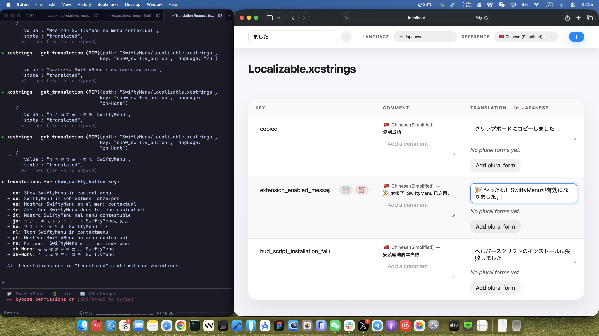

# xcstrings-mcp

A Rust implementation of a Model Context Protocol (MCP) server designed for working with Xcode `Localizable.xcstrings` files. It exposes the translation catalog as MCP tools and also serves a lightweight web UI so teams can browse, search, and edit strings from a browser.



## Features

- Async-safe store that loads and persists `Localizable.xcstrings` JSON on every change.
- MCP toolset for listing, retrieving, creating, updating, and deleting translations (including plural variations) and comments.
- Tool for enumerating all languages discovered in the file.
- Embedded Axum web UI for browsing translations, filtering by query, editing values, plural variations, and managing comments.
- JSON-first responses from tools to make automation and debugging easier.

## Prerequisites

- [Rust](https://www.rust-lang.org/tools/install) 1.75 or newer.

## Running the server

```bash
cargo run -- [path-to/Localizable.xcstrings] [port]
# This will build and run the server against the specified file on the given port (default: 8787)
```

```bash
cargo install --path .
# This will install `xcstrings-mcp` into `~/.cargo/bin/`
```

- `path-to/Localizable.xcstrings`: Optional. When omitted, the server runs in dynamic-path mode (web UI disabled) and every MCP call must supply a `path` argument.
- `port`: Optional. Defaults to `8787`.

You can also configure the server via environment variables:

| Variable       | Description                   | Default                |
| -------------- | ----------------------------- | ---------------------- |
| `STRINGS_PATH` | Path to the `.xcstrings` file | _unset_ (dynamic mode) |
| `WEB_HOST`     | Host/interface for the web UI | `127.0.0.1`            |
| `WEB_PORT`     | Port for the web UI           | `8787`                 |

The web interface becomes available at `http://<host>:<port>/`.

### MCP usage

Run the binary with stdio transport (default) and wire it into an MCP-enabled client. The following tools are exposed (each expects a `path` argument pointing to the target `.xcstrings` file):

- `list_translations(path, query?, limit?, include_values?)`
- `get_translation(path, key, language)`
- `upsert_translation(path, key, language, value?, state?, variations?)`
- `delete_translation(path, key, language)`
- `delete_key(path, key)`
- `set_comment(path, key, comment?)`
- `list_languages(path)`

Each tool returns JSON payloads encoded into text content for easier consumption.

`list_translations` now returns compact summaries (`key`, `comment`, `languages`, and `hasVariations`) so responses stay lightweight even for large catalogs. Use `limit` (defaults to 100, set to `0` for no limit) to page through results, and pass `include_values: true` when you intentionally want the full translation payload inline. Pair it with `get_translation` for per-language details without flooding the client context.

The optional `variations` argument mirrors the `.xcstrings` schema. Provide an object that maps selectors (for example `"plural"`) to their cases, where each case includes the same shape as `upsert_translation` (value, state, nested variations). Missing selectors or cases are left untouched so you can patch individual plural entries without resending the entire localization.

If the server starts without a default path (no CLI argument and no `STRINGS_PATH`), the web UI remains disabled and every MCP call must provide `path`. Supplying a default path re-enables the web UI and becomes the fallback when `path` is omitted.

### Integrating with AI tools

Modern MCP-aware AI clients let you register external servers through a JSON manifest. As an example, the following snippet adds `xcstrings-mcp` to Claude Desktop — copy it into `~/Library/Application Support/Claude/claude_desktop_config.json` (creating the file if it does not exist) and adjust the command path to match your environment:

```json
{
  "mcpServers": {
    "xcstrings": {
      "command": "/Users/you/.cargo/bin/xcstrings-mcp",
      "transport": "stdio",
      "env": {
        "WEB_HOST": "127.0.0.1",
        "WEB_PORT": "8787"
      }
    }
  }
}
```

Restart the client after saving so it loads the new MCP server definition. During tool calls, include a `path` field (for example `"path": "/Users/you/Projects/Localizable.xcstrings"`) so the server knows which localization file to open. Other tools that support the Model Context Protocol use a similar JSON representation—point the `command` to the built binary and pass any arguments or environment overrides you need.

To run with a default localization file (enabling the embedded web UI and letting tools omit `path`), bake the location into the definition instead:

```json
{
  "mcpServers": {
    "xcstrings": {
      "command": "/Users/you/.cargo/bin/xcstrings-mcp",
      "args": ["--", "/Users/you/Projects/Localizable.xcstrings"],
      "transport": "stdio",
      "env": {
        "WEB_HOST": "127.0.0.1",
        "WEB_PORT": "8787"
      }
    }
  }
}
```

You can supply the path via `STRINGS_PATH` instead of CLI arguments if you prefer. In either case, tool calls may omit `path` and the web UI will mount the default file.

> **Note**
> Legacy environment variables with the `XCSTRINGS_` prefix are still accepted for backward compatibility, but prefer the shorter names above going forward.

## Development

Install dependencies and run the full test suite:

```bash
cargo test
```

`cargo fmt --all` is recommended before submitting changes.

## Project layout

- `src/store.rs` – async storage layer for `.xcstrings` files.
- `src/mcp_server.rs` – MCP tool definitions exposing translation functionality.
- `src/web/mod.rs` – Axum HTTP routes and HTML/JS single page view.
- `src/main.rs` – entrypoint that launches both web and MCP services.

## License

Distributed under the [MIT License](LICENSE).
