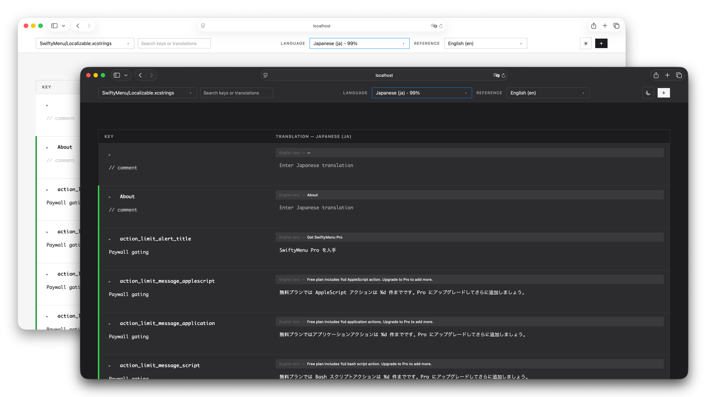

# xcstrings-mcp

[](https://www.rust-lang.org)
[](https://opensource.org/licenses/MIT)
[](https://github.com/lexrus/xcstrings_mcp/stargazers)

A Rust implementation of a __Model Context Protocol (MCP) server__ designed for working with Xcode `.xcstrings` files. It exposes the translation catalog as MCP tools and also serves a __lightweight web editor__ so teams can browse, search, and edit strings from a browser.

> **Note**: This project was created with AI assistance using tools like Codex and Claude Code. While we strive for quality, there may be issues or areas for improvement. We welcome bug reports, feature requests, and contributions via [GitHub Issues](https://github.com/lexrus/xcstrings_mcp/issues).




## Functions

This MCP server provides the following functions for managing Xcode `Localizable.xcstrings` files:

### Core Translation Functions

- **`list_translations(path, query?, limit?)`** - List translation entries with optional filtering
  - `path`: Path to the `.xcstrings` file
  - `query`: Optional case-insensitive search query to filter results
  - `limit`: Maximum number of items to return (defaults to 100, set to 0 for no limit)
  - Returns: JSON array of translation summaries including key metadata

- **`list_keys(path, query?, limit?)`** - List translation keys without loading full records
  - `path`: Path to the `.xcstrings` file
  - `query`: Optional case-insensitive search query to filter results
  - `limit`: Maximum number of items to return (defaults to 100, set to 0 for no limit)
  - Returns: JSON payload containing `keys`, `total`, `returned`, and `truncated` flags

- **`get_translation(path, key, language)`** - Fetch a single translation by key and language
  - `path`: Path to the `.xcstrings` file
  - `key`: Translation key identifier
  - `language`: Language code (e.g., "en", "fr", "es")
  - Returns: Complete translation value with variations and substitutions

- **`upsert_translation(path, key, language, value?, state?, variations?, substitutions?)`** - Create or update a translation
  - `path`: Path to the `.xcstrings` file
  - `key`: Translation key identifier
  - `language`: Language code
  - `value`: Translation text (optional)
  - `state`: Translation state (optional)
  - `variations`: Map of variation selectors to their cases (e.g., plural forms)
  - `substitutions`: Map of substitution identifiers with metadata
  - Returns: Updated translation value

- **`delete_translation(path, key, language)`** - Delete a translation for a specific language
  - `path`: Path to the `.xcstrings` file
  - `key`: Translation key identifier
  - `language`: Language code to remove
  - Returns: Success confirmation

### Key Management Functions

- **`delete_key(path, key)`** - Delete an entire translation key across all languages
  - `path`: Path to the `.xcstrings` file
  - `key`: Translation key identifier to remove completely
  - Returns: Success confirmation

- **`set_comment(path, key, comment?)`** - Set or clear the developer comment for a translation key
  - `path`: Path to the `.xcstrings` file
  - `key`: Translation key identifier
  - `comment`: Developer comment text (optional, omit to clear)
  - Returns: Success confirmation

- **`set_extraction_state(path, key, extractionState?)`** - Set or clear the extraction state for a string key
  - `path`: Path to the `.xcstrings` file
  - `key`: Translation key identifier
  - `extractionState`: Extraction state value (optional, omit to clear)
  - Returns: Success confirmation

### Language Management Functions

- **`list_languages(path)`** - List all languages present in the xcstrings file
  - `path`: Path to the `.xcstrings` file
  - Returns: JSON array of language codes found in the catalog

- **`add_language(path, language)`** - Add a new language to the xcstrings file
  - `path`: Path to the `.xcstrings` file
  - `language`: Language code to add (e.g., "fr", "es", "de")
  - Returns: Success confirmation
  - Note: Creates placeholder entries in existing keys with `needs-translation` state so the language is immediately discoverable

- **`remove_language(path, language)`** - Remove a language from the xcstrings file
  - `path`: Path to the `.xcstrings` file
  - `language`: Language code to remove
  - Returns: Success confirmation
  - Note: Cannot remove the source language (typically "en")

- **`update_language(path, oldLanguage, newLanguage)`** - Rename/update a language code in the xcstrings file
  - `path`: Path to the `.xcstrings` file
  - `oldLanguage`: Current language code to rename
  - `newLanguage`: New language code
  - Returns: Success confirmation
  - Note: Cannot rename the source language; preserves all existing translations

### Additional Features

- **Async-safe store** that loads and persists `Localizable.xcstrings` JSON on every change
- **Embedded Axum web UI** for browsing translations, filtering by query, editing values, plural/device variations, and managing comments
- **Automatic discovery** of `.xcstrings` files when no default path is provided, with a selector in the web UI for runtime catalog switching
- **Device-specific variations** support (iPhone, iPad, Mac, Apple Watch, etc.) with mutual exclusivity logic between plural and device variations
- **Inline editing** for extraction state, translation state, and substitution placeholders (including `argNum`, `formatSpecifier`, and nested plural cases)
- **JSON-first responses** from all tools to make automation and debugging easier
- **Schema-backed validation** using the vendored [`xcstrings.schema.json`](schema/xcstrings.schema.json) to keep generated catalogs consistent with Apple's format

## Prerequisites

- **Rust 1.75 or newer**: Install using Homebrew (recommended on macOS):

  ```bash
  brew install rust
  ```

  Alternatively, install using the official installer:

  ```bash
  curl --proto '=https' --tlsv1.2 -sSf https://sh.rustup.rs | sh
  ```

  After installation, restart your terminal or run `source ~/.cargo/env` to update your PATH.

## Running the server

```bash
cargo run -- [path-to/Localizable.xcstrings] [port]
# This will build and run the server against the specified file on the given port (default: 8787)
```

```bash
cargo install --path .
# This will install `xcstrings-mcp` into `~/.cargo/bin/`
```

- `path-to/Localizable.xcstrings`: Optional. When omitted, the server scans the workspace for `.xcstrings` files. The web UI stays available with a selector (showing a placeholder when none are found), while MCP tool calls must continue to supply a `path` argument.
- `port`: Optional. Defaults to `8787`.

You can also configure the server via environment variables:

| Variable       | Description                   | Default                |
| -------------- | ----------------------------- | ---------------------- |
| `STRINGS_PATH` | Path to the `.xcstrings` file | _unset_ (dynamic mode) |
| `WEB_HOST`     | Host/interface for the web UI | `127.0.0.1`            |
| `WEB_PORT`     | Port for the web UI           | `8787`                 |

The web interface becomes available at `http://<host>:<port>/`.

### MCP usage

Run the binary with stdio transport (default) and wire it into an MCP-enabled client. The following tools are exposed (each expects a `path` argument pointing to the target `.xcstrings` file):

- `list_translations(path, query?, limit?)`
- `list_keys(path, query?, limit?)`
- `get_translation(path, key, language)`
- `upsert_translation(path, key, language, value?, state?, variations?)`
- `delete_translation(path, key, language)`
- `delete_key(path, key)`
- `set_comment(path, key, comment?)`
- `set_extraction_state(path, key, extractionState?)`
- `list_languages(path)`
- `add_language(path, language)`
- `remove_language(path, language)`
- `update_language(path, oldLanguage, newLanguage)`

Each tool returns JSON payloads encoded into text content for easier consumption.

`list_translations` now returns compact summaries (`key`, `comment`, `extractionState`, `languages`, and `hasVariations`) so responses stay lightweight even for large catalogs. Use `limit` (defaults to 100, set to `0` for no limit) to page through results and pair it with `get_translation` for per-language details without flooding the client context.

When calling `upsert_translation`, you can send:

- `variations` — map selectors (e.g. `"plural"`) to their cases; each case is another translation update.
- `substitutions` — map substitution identifiers (`"arg1"`, `"device"`, etc.) to updates containing `value`, `state`, `argNum`, `formatSpecifier`, and nested `variations`.
  Missing selectors or substitutions are left untouched so you can patch individual pieces without resending the entire localization payload.

If the server starts without a default path (no CLI argument and no `STRINGS_PATH`), it scans the working tree for `.xcstrings` files and surfaces them through the web UI selector. When none are found, the UI shows a placeholder until a file appears. MCP tools still require an explicit `path` in this mode. Providing a default path pins the selector to that file and lets tool calls omit `path`.

### Integrating with AI tools

Modern MCP-aware AI clients let you register external servers through a JSON manifest. As an example, the following snippet adds `xcstrings-mcp` to Claude Code:

`claude mcp add-json xcstrings '{"command":"/Users/you/.cargo/bin/xcstrings-mcp","transport":"stdio","env":{"WEB_HOST": "127.0.0.1","WEB_PORT": "8787"}}'`

You can also add it manually to `~/.claude.json`:

```json
{
  "mcpServers": {
    "xcstrings": {
      "command": "/Users/you/.cargo/bin/xcstrings-mcp",
      "transport": "stdio",
      "env": {
        "WEB_HOST": "127.0.0.1",
        "WEB_PORT": "8787"
      }
    }
  }
}
```

Restart the client after saving so it loads the new MCP server definition. The `path` parameter is optional in tool calls—if not provided, the server will automatically discover all `.xcstrings` files in your project and list them in the web editor for selection.

To run with a default localization file (enabling the embedded web UI and letting tools omit `path`), bake the location into the definition instead:

```json
{
  "mcpServers": {
    "xcstrings": {
      "command": "/Users/you/.cargo/bin/xcstrings-mcp",
      "args": ["--", "/Users/you/Projects/Localizable.xcstrings"],
      "transport": "stdio",
      "env": {
        "WEB_HOST": "127.0.0.1",
        "WEB_PORT": "8787"
      }
    }
  }
}
```

You can supply the path via `STRINGS_PATH` instead of CLI arguments if you prefer. In either case, tool calls may omit `path` and the web UI will mount the default file.

> **Note**
> Legacy environment variables with the `XCSTRINGS_` prefix are still accepted for backward compatibility, but prefer the shorter names above going forward.

## Development

Install dependencies and run the full test suite:

```bash
cargo test
```

`cargo fmt --all` is recommended before submitting changes.

The repository vendors the official schema as a git submodule under `schema/`. Use `git submodule update --init --remote` to pull the latest definition when updating validation logic.

## Project layout

- `src/store.rs` – async storage layer for `.xcstrings` files.
- `src/mcp_server.rs` – MCP tool definitions exposing translation functionality.
- `src/web/mod.rs` – Axum HTTP routes and HTML/JS single page view.
- `src/main.rs` – entrypoint that launches both web and MCP services.

## Support

If you find this project useful, consider supporting me by buying me a coffee.

<a href="https://www.buymeacoffee.com/lexrus" target="_blank"></a>

## License

Distributed under the [MIT License](LICENSE).
